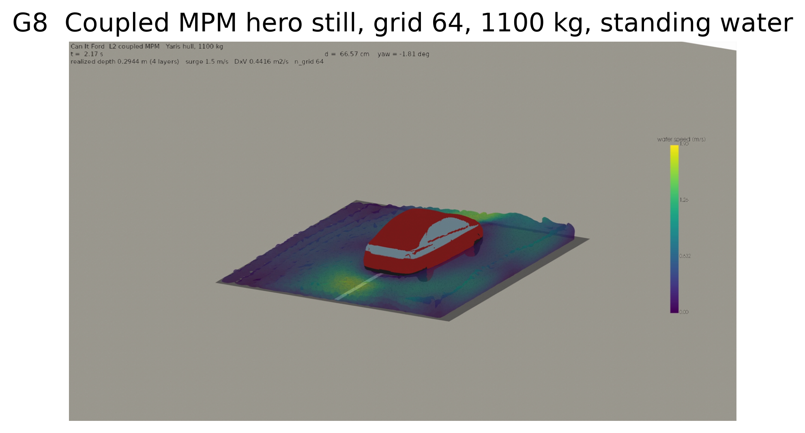

# Josephine Cerrell

Integrated Sciences student at Claremont McKenna College. I build GPU physics simulations, and the
checks that make their results trustworthy.

**Summer 2026:** NSF SCIPE REU scholar (Chishiki AI scholarship), GeoElements Lab, UT Austin, with
simulation work on TACC's Vista (NVIDIA GH200) and Lonestar6 (NVIDIA A100) systems.
PI: Dr. Krishna Kumar.

---

## Featured project: Can It Ford?

*Water coloured by speed around a 1,100 kg Toyota Yaris hull, run g64_m1100 from the 17-run sweep.*

Can a specific car cross a specific flooded road? I compared three answers of increasing cost: a
depth rule of thumb, the published Australian Rainfall and Runoff (AR&R) vehicle hazard criterion,
and a coupled material point method (MPM) simulation of water and a rigid vehicle hull on GPUs.

- **17 simulation runs with a provenance record that says how each field was obtained.** Each
  run logged its own grid and physics settings. The code commit, solver version and mesh hash
  were filled in afterwards and are labelled that way: the commit is a reconstruction, not a
  record of what ran.
- **Caught a rule being applied halfway.** The depth x velocity product on its own is only part of
  the published AR&R rule, and an earlier version of this project's own code used it that way.
  Applying the full two-part rule for the car's class moved 23 of 70 flood scenarios to NO-FORD,
  and none the other way.
- **3D scene reconstruction.** Trained a 1,147,694-Gaussian splat of a real drainage crossing with
  gsplat (30,000 iterations, PSNR 22.74).
- **Open results.** An interactive demo, published datasets with full data cards, and automated
  checks that run in GitHub Actions.

[Code](https://github.com/jcerrell-IS/can-it-ford) ·
[Live demo](https://huggingface.co/spaces/josiecerrell/can-it-ford) ·
[Findings](https://huggingface.co/spaces/josiecerrell/can-it-ford-findings) ·
[Scenario data](https://huggingface.co/datasets/josiecerrell/can-it-ford-scenario-sweep) ·
[Load-surface data](https://huggingface.co/datasets/josiecerrell/can-it-ford-speed-surface)

I also contributed watertight-mesh particle seeding and content-based PLY loading to a fork of the
lab's Warp-based MPM engine: [jcerrell-IS/mpm-engine](https://github.com/jcerrell-IS/mpm-engine).

---

## Tools I used in this work

Python · NumPy · matplotlib · NVIDIA Warp (warpmpm) · gsplat · Slurm on TACC · Linux ·
Git and GitHub Actions · Gradio · Hugging Face Hub · Weights & Biases

## Contact

[LinkedIn](https://www.linkedin.com/in/josephinecerrell) ·
[Hugging Face](https://huggingface.co/josiecerrell) ·
jcerrell29@students.claremontmckenna.edu
