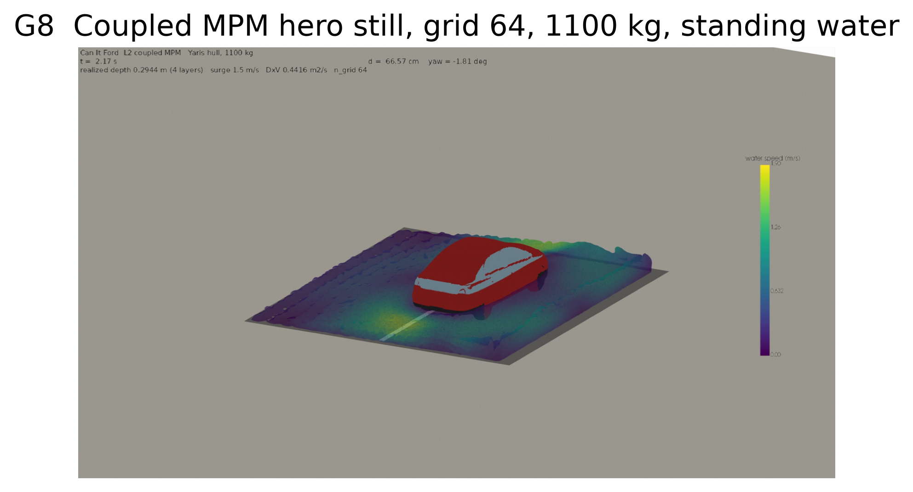

# Josephine Cerrell

Integrated Sciences student at Claremont McKenna College (class of 2029).

**Summer 2026:** NSF REU student at the Texas Advanced Computing Center (TACC), UT Austin, in
Dr. Krishna Kumar's GeoElements Lab.

---

## Project: Can It Ford?

*Simulated water around a Toyota Yaris, colored by speed (from one of the first runs).*

Can a car safely drive through a flooded road? I compared three ways of answering: a simple
water-depth rule, the Australian flood guideline for vehicles (AR&R), and a GPU simulation of
water flowing around a 2010 Toyota Yaris.

- Found that using the full AR&R guideline, instead of the depth x speed shortcut people often
  use, changes 23 of 70 flood cases from safe to unsafe.
- Ran the simulations on TACC's Lonestar6 and Vista supercomputers. My first 17 runs turned out to
  be measuring the start of the flow instead of a steady current, so I set those results aside and
  started a new set of 46 runs. That set doesn't have a final answer yet.
- Recorded the settings for every run so the results can be checked and repeated.
- Made a 3D model of a real flooded drainage crossing from video using Gaussian splatting.
- Added two features to the lab's simulation code for loading car models, and fixed a bug in it:
  [jcerrell-IS/mpm-engine](https://github.com/jcerrell-IS/mpm-engine).

[Paper](https://github.com/jcerrell-IS/can-it-ford/blob/main/public_release/Cerrell_CanItFord_paper.pdf) ·
[Code](https://github.com/jcerrell-IS/can-it-ford) ·
[Live demo](https://huggingface.co/spaces/josiecerrell/can-it-ford) ·
[Simulation records](https://huggingface.co/datasets/josiecerrell/can-it-ford-steady-force) ·
[Scenario data](https://huggingface.co/datasets/josiecerrell/can-it-ford-scenario-sweep)

## Tools

Python, NumPy, matplotlib, NVIDIA Warp, gsplat, Slurm, Linux, Git, GitHub Actions, Gradio,
Hugging Face

## Contact

[LinkedIn](https://www.linkedin.com/in/josephinecerrell) ·
[Hugging Face](https://huggingface.co/josiecerrell) ·
jcerrell29@students.claremontmckenna.edu
